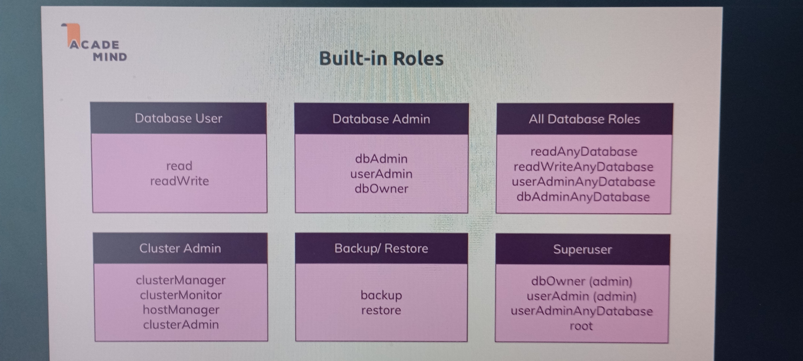

### Security

- Authentication and Authorization
- Transport Encryption
- Encryption at Rest
- Auditing
- Server and network config and setup
- Backups an d software updates

- ### Roles

- ### Built-in role

### Useful Resources & Links
Helpful Articles/ Docs:

Official "Encryption at Rest" Docs: https://docs.mongodb.com/manual/core/security-encryption-at-rest/

Official Security Checklist: https://docs.mongodb.com/manual/administration/security-checklist/

What is SSL/ TLS? => https://www.acunetix.com/blog/articles/tls-security-what-is-tls-ssl-part-1/

Official MongoDB SSL Setup Docs: https://docs.mongodb.com/manual/tutorial/configure-ssl/

Official MongoDB Users & Auth Docs: https://docs.mongodb.com/manual/core/authentication/

Official Built-in Roles Docs: https://docs.mongodb.com/manual/core/security-built-in-roles/

Official Custom Roles Docs: https://docs.mongodb.com/manual/core/security-user-defined-roles/