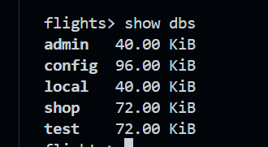
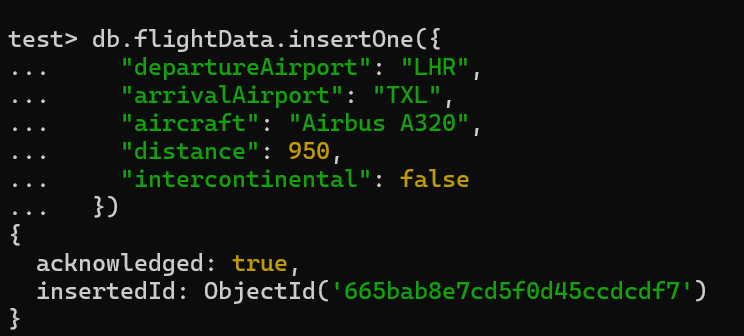
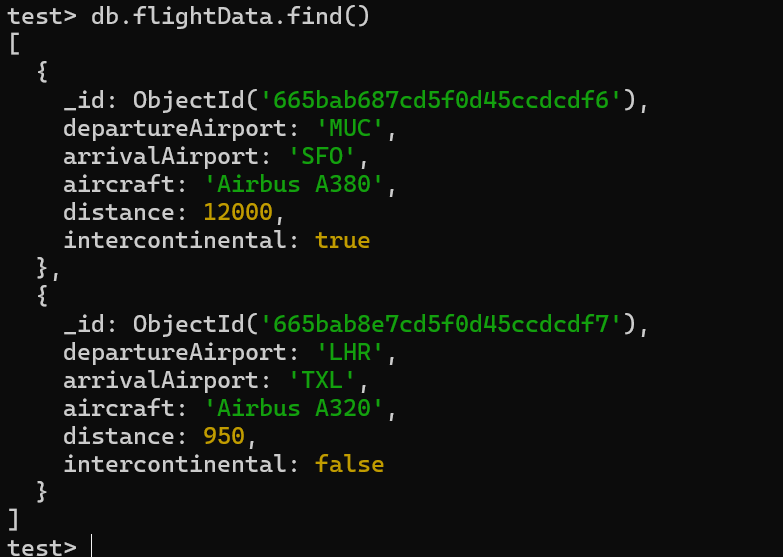

`show dbs` - to display all the available databases

``use x`` - x is db name--> no need to write command for creating as this automatically creates a db  

``db.flightData.insertOne({})`` --- db is the database, flightData is the like the table, insertOne is inserting one row of data 

``db.flightData.find()`` --- to show all the contents in the table

