# Crud operation

`show dbs` - to display all the available databases

``use x`` - x is db name--> no need to write command for creating as this automatically creates a db  

``db.flightData.insertOne({})`` --- db is the database, flightData is the like the table, insertOne is inserting one row of data 

``db.flightData.find()`` --- to show all the contents in the table

### ``CRUD OPERATIONS``
 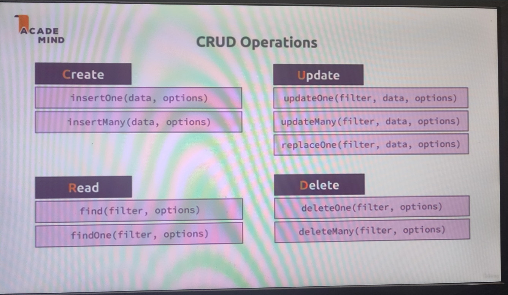

- `updateOne()`
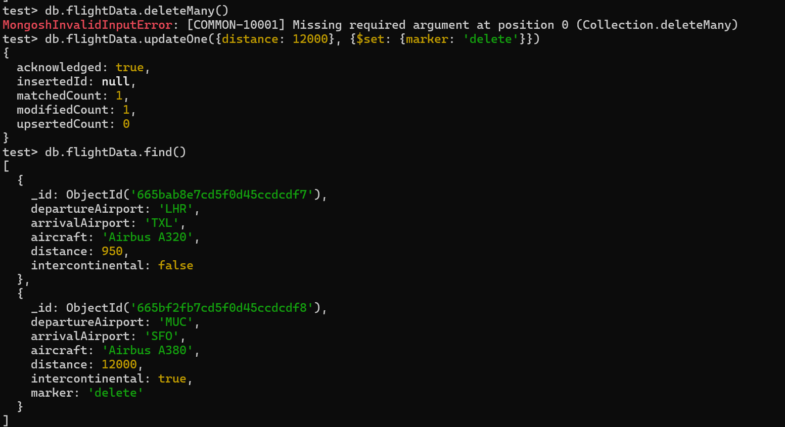

- `updateMany()`
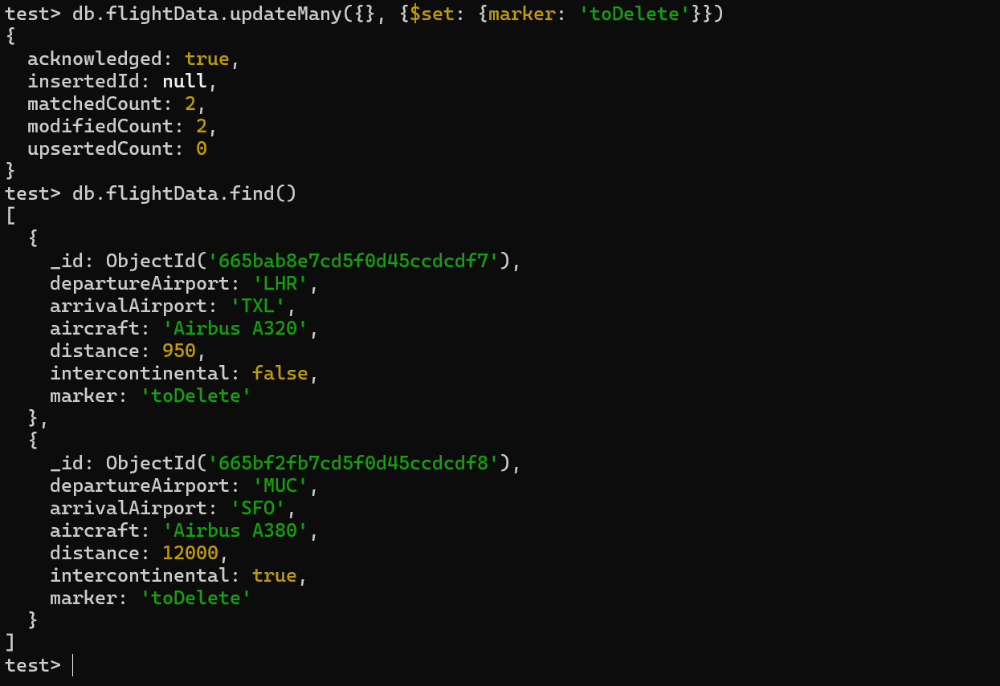

- `deleteMany()`
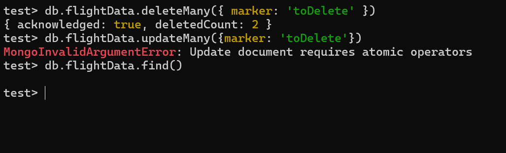

- `insertMany()`
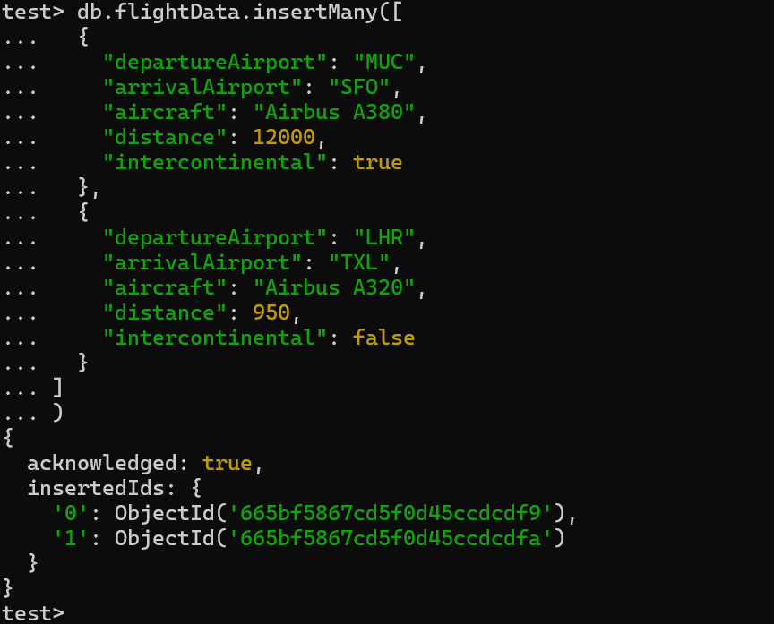

-  `find` - filter
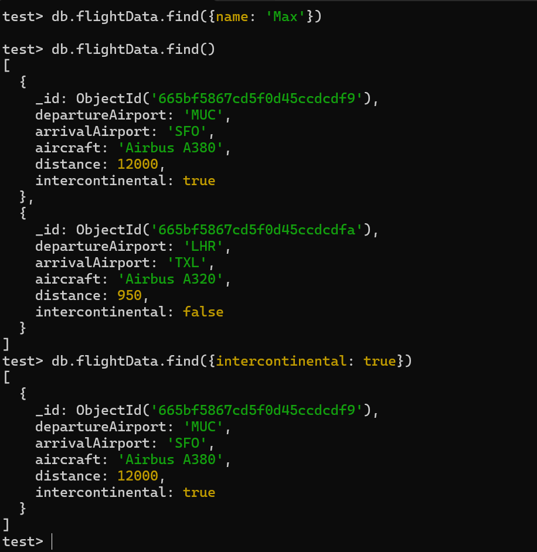

- ### `db.flightData.find({distance: {$gt: 10000}})`
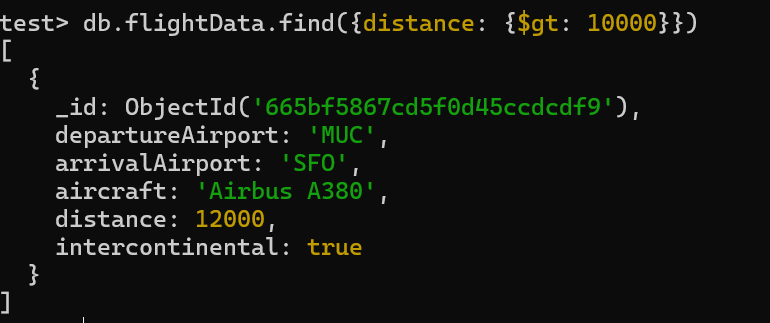

- `db.flightData.findOne({distance: {$gt: 100}})`    - finds only first one
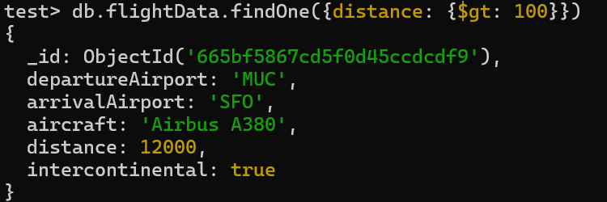

-  `db.flightData.updateOne({ _id: ObjectId('665bf5867cd5f0d45ccdcdf9')}, {$set: {delayed:true}})` 
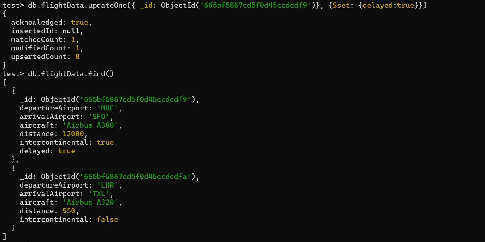

- `db.flightData.update({ _id: ObjectId('665bf5867cd5f0d45ccdcdf9')}, {$set: {delayed:false}})` 
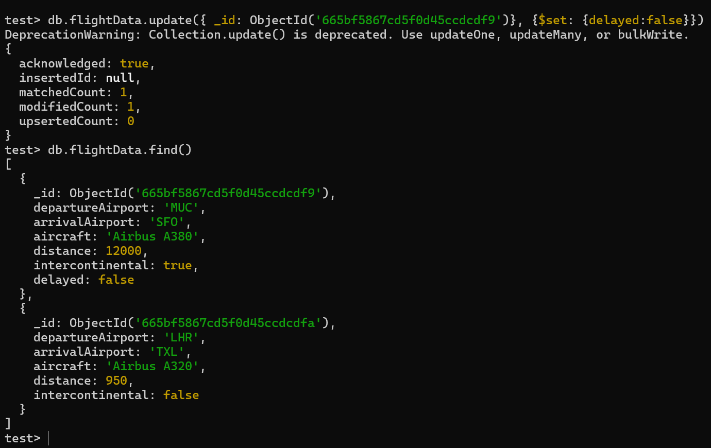

- `replaceOne()` - safer way to replace data

- `db.passengers.find().toArray()` - this gives all the values in the document but find() gives only top 20
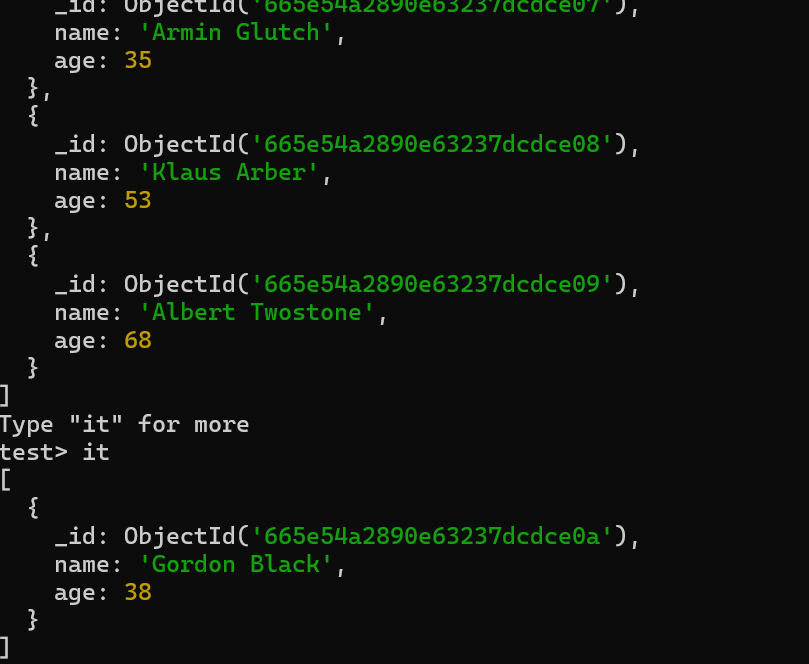
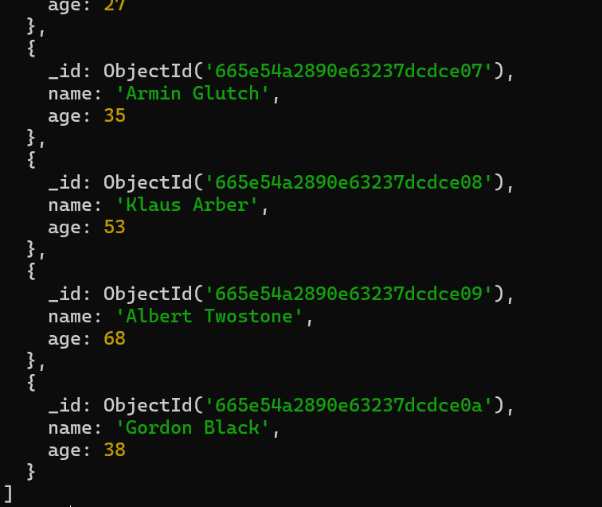

- `db.passengers.find().forEach((passData) => {printjson(passData)})` - for react for large documents 

- `db.passengers.find({}, {name: 1})` - projection - filters columns
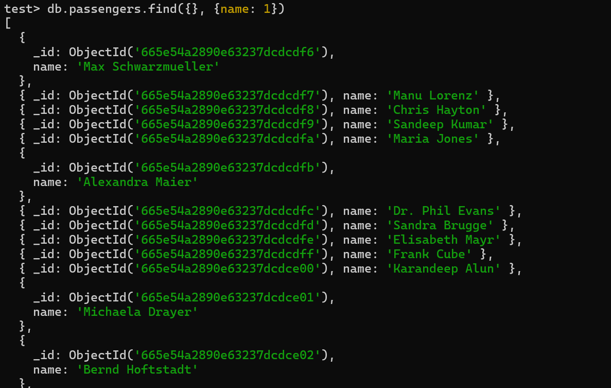

- `db.passengers.find({}, {name: 1, _id: 0})` - 1 if we need column, 0 if not needed
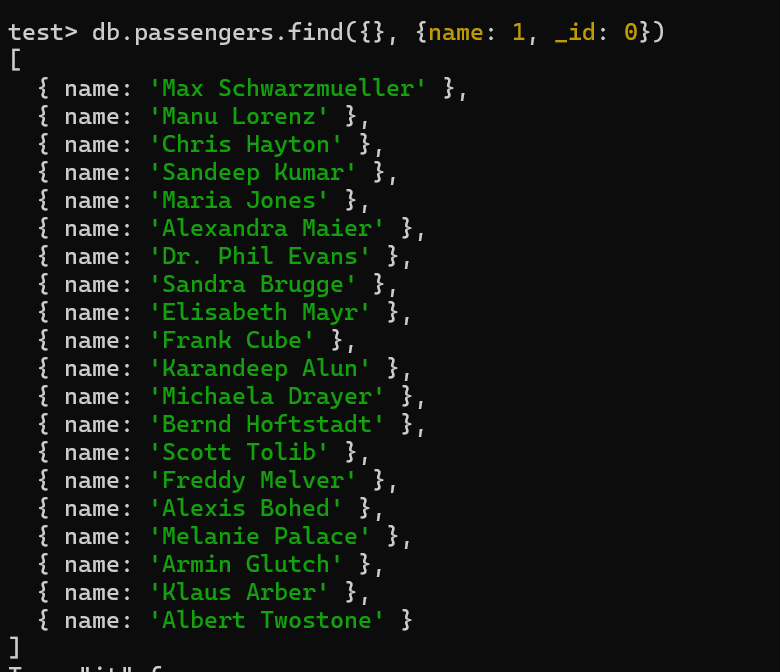

- ` db.flightData.updateMany({}, {$set: {status: {decription: 'on-time', lastUpdated: '1 houir ago'}}})` - embedded documents
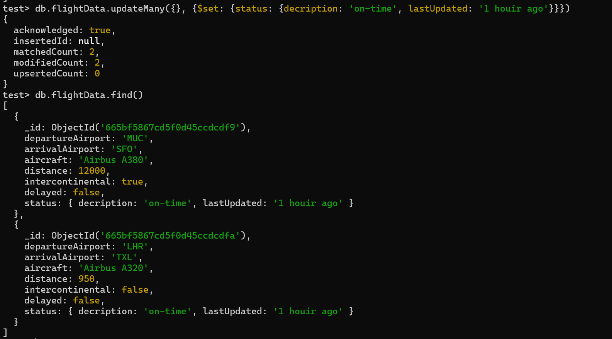

- `db.passengers.updateOne({name:'Albert Twostone'},{$set :{hobbies:['sports','cooking']}})` - working with arrays
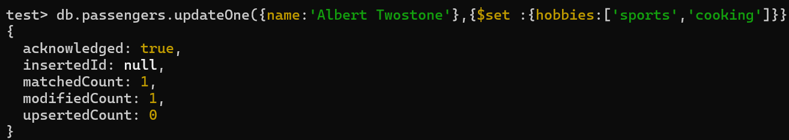

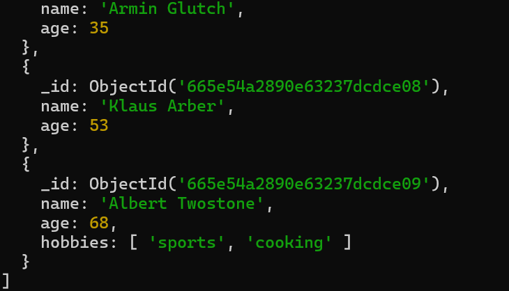

- `db.passengers.findOne({name: 'Albert Twostone'}).hobbies`  - accessing structure Data
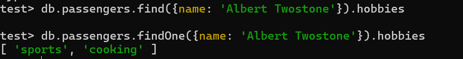

- `db.passengers.find({hobbies: 'sports'})` - find thru keyword
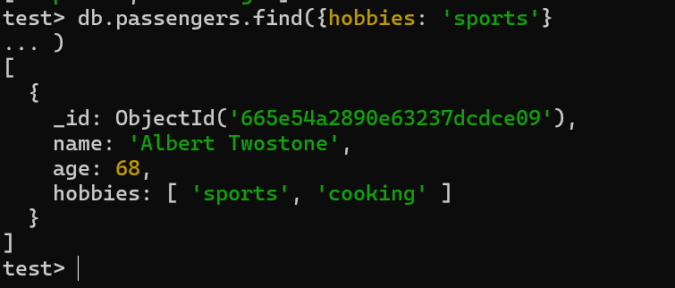