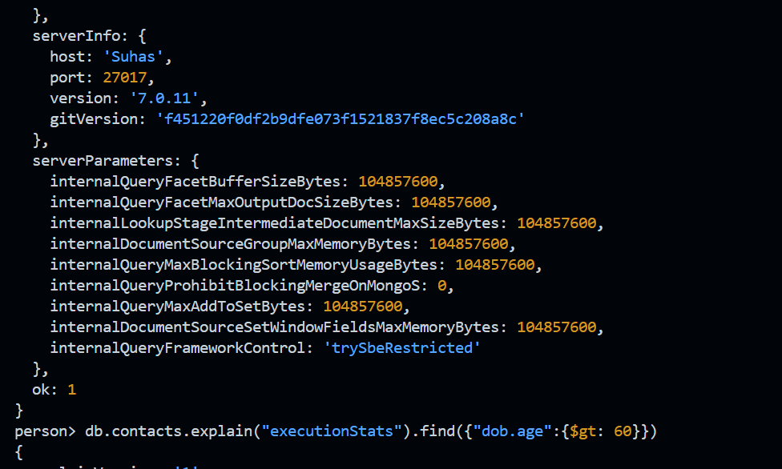

### Working with Indexes

`db.contacts.explain().find({"dob.age":{$gt: 60}})`

`db.contacts.explain("executionStats").find({"dob.age":{$gt: 60}})`

`db.persons.createIndex({"dob:age": 1})` - 1- ascending;-1-descending

## Indexes Behind the Scenes
What does createIndex() do in detail?

Whilst we can't really see the index, you can think of the index as a simple list of values + pointers to the original document.

Something like this (for the "age" field):

(29, "address in memory/ collection a1")

(30, "address in memory/ collection a2")

(33, "address in memory/ collection a3")

The documents in the collection would be at the "addresses" a1, a2 and a3. The order does not have to match the order in the index (and most likely, it indeed won't).

The important thing is that the index items are ordered (ascending or descending - depending on how you created the index). createIndex({age: 1}) creates an index with ascending sorting, createIndex({age: -1}) creates one with descending sorting.

MongoDB is now able to quickly find a fitting document when you filter for its age as it has a sorted list. Sorted lists are way quicker to search because you can skip entire ranges (and don't have to look at every single document).

Additionally, sorting (via sort(...)) will also be sped up because you already have a sorted list. Of course this is only true when sorting for the age.

- The first command, `db.persons.createIndex({"dob.age":1,gender: 1})`, creates a compound index on the `persons` collection, sorting first by the `dob.age` field in ascending order and then by the `gender` field in ascending order. This index can optimize query performance for searches that specify both `dob.age` and `gender` fields. The second command, `db.persons.explain().find({"dob.age":35, gender: "male"})`, explains how MongoDB will execute the query that searches for documents where `dob.age` is 35 and `gender` is "male". The third command, `db.persons.explain().find({"dob.age":35})`, explains how MongoDB will execute the query that searches for documents where `dob.age` is 35, without considering the `gender` field. The `explain()` method provides details about the query execution plan, such as whether the index is used, the number of documents scanned, and the performance of the query.   (uses stage: 'IXSCAN' ---> index scan)

`db.persons.createIndex({"dob.age":1,gender: 1})`

`db.persons.explain().find({"dob.age":35, gender: "male"})`
`

`db.persons.explain().find({"dob.age":35})`