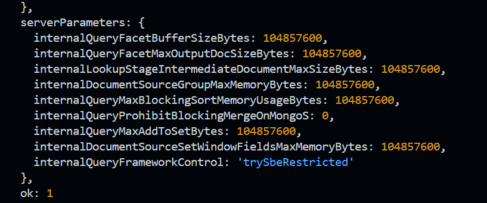

### Working with Indexes

`db.contacts.explain().find({"dob.age":{$gt: 60}})`

`db.contacts.explain("executionStats").find({"dob.age":{$gt: 60}})`

`db.persons.createIndex({"dob:age": 1})` - 1- ascending;-1-descending

