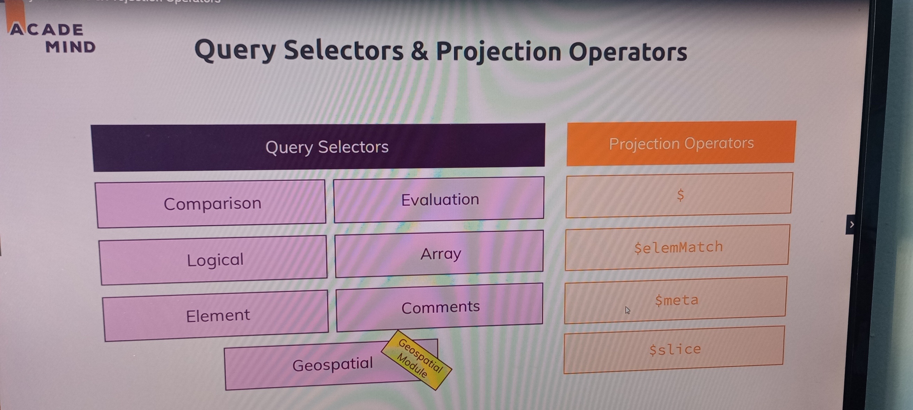
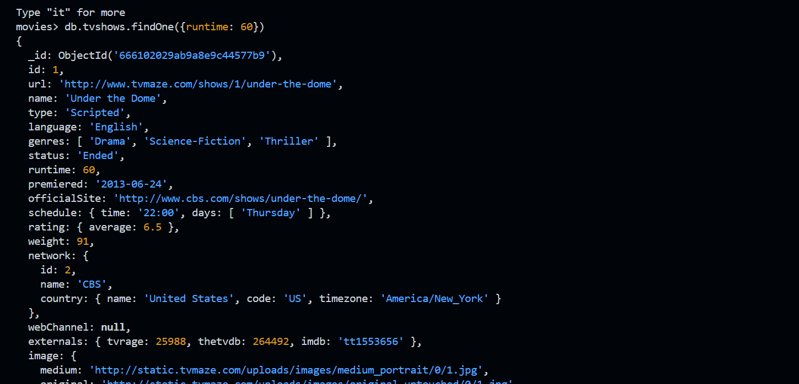

### Read-Operations-A closer Look
- Query Selectors Comparison
For comparison of different BSON type values, see the specified BSON comparison order.

`$eq`
Matches values that are equal to a specified value.
`$gt
`Matches values that are greater than a specified value.
`$gte`
Matches values that are greater than or equal to a specified value.
`$in`
Matches any of the values specified in an array.
`$lt`
Matches values that are less than a specified value.
`$lte`
Matches values that are less than or equal to a specified value.
`$ne`
Matches all values that are not equal to a specified value.
`$nin`
Matches none of the values specified in an array.

- Logical

`$and`
Joins query clauses with a logical AND returns all documents that match the conditions of both clauses.
`$not`
Inverts the effect of a query expression and returns documents that do not match the query expression.
`$nor`
Joins query clauses with a logical NOR returns all documents that fail to match both clauses.
`$or`
Joins query clauses with a logical OR returns all documents that match the conditions of either clause.

- Element

`$exists`
Matches documents that have the specified field.
`$type`
Selects documents if a field is of the specified type.

- Evaluation
`$expr`
Allows use of aggregation expressions within the query language.
`$jsonSchema`
Validate documents against the given JSON Schema.
`$mod`
Performs a modulo operation on the value of a field and selects documents with a specified result.
`$regex`
Selects documents where values match a specified regular expression.
`$text`
Performs text search.
`$where`
Matches documents that satisfy a JavaScript expression.

- Geospatial

`$geoIntersects`
Selects geometries that intersect with a GeoJSON geometry. The 2dsphere index supports $geoIntersects.
`$geoWithin`
Selects geometries within a bounding GeoJSON geometry. The 2dsphere and 2d indexes support $geoWithin.
`$near`
Returns geospatial objects in proximity to a point. Requires a geospatial index. The 2dsphere and 2d indexes support $near.
`$nearSphere`
Returns geospatial objects in proximity to a point on a sphere. Requires a geospatial index. The 2dsphere and 
2d indexes support $nearSphere.

- Array

`$all`
Matches arrays that contain all elements specified in the query.
`$elemMatch`
Selects documents if element in the array field matches all the specified $elemMatch conditions.
`$size`
Selects documents if the array field is a specified size.

- Bitwise

`$bitsAllClear`
Matches numeric or binary values in which a set of bit positions all have a value of 0.
`$bitsAllSet`
Matches numeric or binary values in which a set of bit positions all have a value of 1.
`$bitsAnyClear`
Matches numeric or binary values in which any bit from a set of bit positions has a value of 0.
`$bitsAnySet`
Matches numeric or binary values in which any bit from a set of bit positions has a value of 1.

- Projection Operators

`$`
Projects the first element in an array that matches the query condition.
`$elemMatch`
Projects the first element in an array that matches the specified $elemMatch condition.
`$meta`
Projects the document's score assigned during $text operation.
`$slice`
Limits the number of elements projected from an array. Supports skip and limit slices.

- Miscellaneous Operators

`$comment`
Adds a comment to a query predicate.
`$rand`
Generates a random float between 0 and 1.

### Query selectors and projection operators

### filter
`db.tvshows.findOne({runtime: 60})`

### cursors

### Useful Resources & Links
Helpful Articles/ Docs:

- More on find(): https://docs.mongodb.com/manual/reference/method/db.collection.find/

- More on Cursors: https://docs.mongodb.com/manual/tutorial/iterate-a-cursor/

- Query Operator Reference: https://docs.mongodb.com/manual/reference/operator/query/