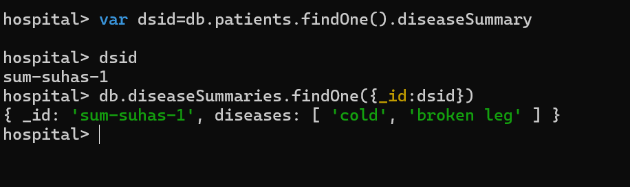
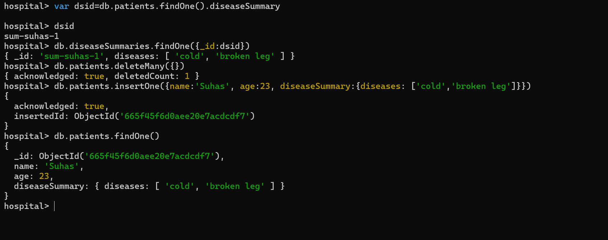

### Structuring the Documents

`db.books.aggregate([{$lookup: {from:"authors",localField: "authors", foreignField: "_id", as:"creators"}}])`

### createCollection()
The provided code creates a MongoDB collection named `posts` with a schema validator that ensures each document contains a `title`, `text`, `creator`, and `comments` field. The `title` and `text` fields must be strings, while the `creator` field must be an ObjectId. The `comments` field must be an array of objects, each containing a `text` field (string) and an `author` field (ObjectId). This schema validation enforces a consistent structure for all documents in the `posts` collection, ensuring data integrity and facilitating easier data management and querying.

`db.createCollection('posts', {
  validator: {
    $jsonSchema: {
      bsonType: 'object',
      required: ['title', 'text', 'creator', 'comments'],
      properties: {
        title: {
          bsonType: 'string',
          description: 'must be a string and is required'
        },
        text: {
          bsonType: 'string',
          description: 'must be a string and is required'
        },
        creator: {
          bsonType: 'objectId',
          description: 'must be an objectid and is required'
        },
        comments: {
          bsonType: 'array',
          description: 'must be an array and is required',
          items: {
            bsonType: 'object',
            required: ['text', 'author'],
            properties: {
              text: {
                bsonType: 'string',
                description: 'must be a string and is required'
              },
              author: {
                bsonType: 'objectId',
                description: 'must be an objectid and is required'
              }
            }
          }
        }
      }
    }
  }
});
`

