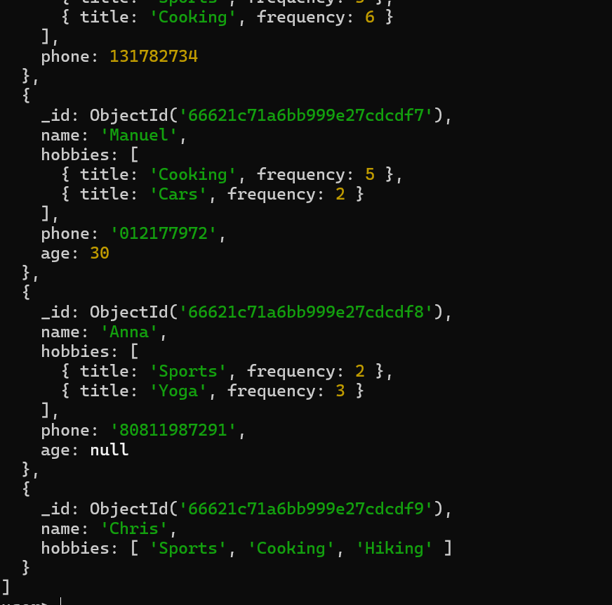
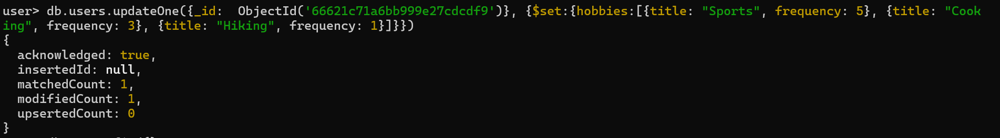
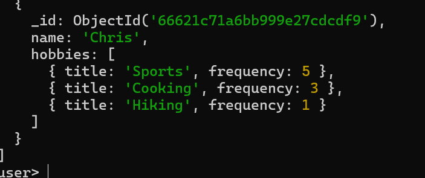

## Update

`db.users.find()`

No phone number, so we can update the data / modify frequencies many more....

`db.users.updateOne({_id:  ObjectId('66621c71a6bb999e27cdcdf9')}, {$set:{hobbies:[{title: "Sports", frequency: 5}, {title: "Cooking", frequency: 3}, {title: "Hiking", frequency: 1}]}})`

